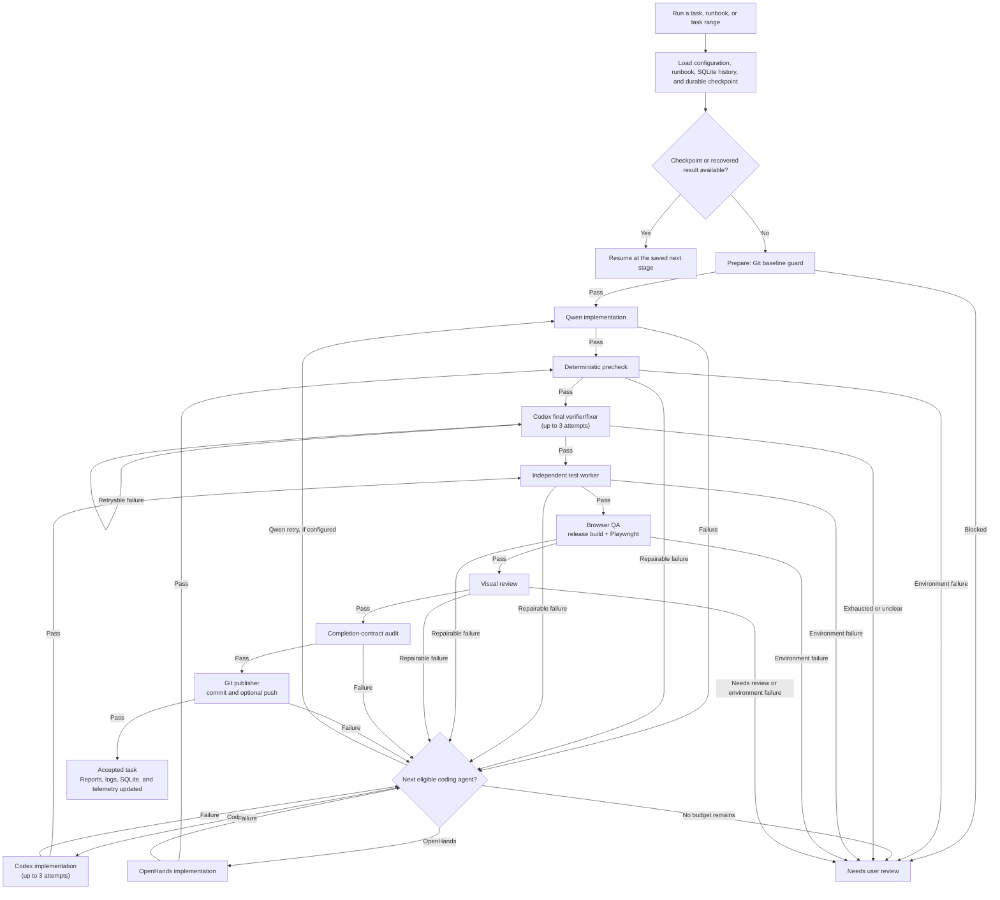

# Supervisor — evidence-gated LangGraph task orchestration

This package orchestrates one small, reviewable runbook task at a time. It
does not run providers by default. Instead, it has safe worker adapters which
return a structured `environment_failure` until an explicit command is configured.

## Quick start

### Install the Supervisor CLI

Download the installer, review it if desired, then run it. It installs into
`~/.local/share/supervisor` and links the commands into `~/.local/bin` without
requiring administrator access:

```zsh
curl -fsSL https://raw.githubusercontent.com/jakowicz/supervisor/main/scripts/install.sh -o /tmp/supervisor-install.sh
bash /tmp/supervisor-install.sh
```

If `~/.local/bin` is not already on your `PATH`, the installer prints the one
`export PATH=...` line to add to your shell profile. Set
`SUPERVISOR_PYTHON=/path/to/python` only when you need to override its automatic
Python 3.10+ selection.

To update the global/installed CLI itself, run:

```zsh
supervisor upgrade
```

To update the Supervisor checkout inside the project you are working in, run
this from that project directory (or one of its subdirectories):

```zsh
supervisor update
```

It finds the nearest `supervisor/` checkout, fast-forwards it, and reinstalls
that project's commands into its virtual environment. It refuses to update when
that checkout has local edits, so it cannot overwrite work. Commit the resulting
submodule-pointer change in the parent project when you are happy with it.

### New project

From an existing Supervisor installation, create a ready-to-configure project:

```zsh
supervisor init
```

The first question asks for the new project directory; enter the location you
want to initialise. You may still pass that directory as an optional argument
when convenient.

`init` automatically selects a compatible Python 3.10+ interpreter from your
`PATH`, then creates a Git repository, adds this repository as `supervisor/`, creates
`runbooks/TEMPLATE.md`, configures ignored root `.state/` evidence storage, and
installs the local virtual environment. It is interactive: it asks for the
initial shared-Langfuse account only when no local service is running, then
prompts for this project's worker commands/models, retry policy, Git policy,
dashboard preference, and Langfuse project credentials. It reuses the one
shared Langfuse service at `http://127.0.0.1:3001` when it is already running.
Use `--non-interactive` only for automated provisioning.

Every setup prompt shows a safe default where one exists. This includes paths,
database location, dashboard port, timeouts, retry budgets, Git policy, the
shared Langfuse endpoint, and the bundled Qwen, OpenHands, Codex, and browser
worker commands. Provider-specific values—model names, API keys, and an
independent visual-review command—remain blank by design rather than being
guessed.

When configuration needs Langfuse project keys, Supervisor first checks the
shared local service. If it is not running, it asks permission to start the
one shared local stack, clearly states that it is installing/starting Langfuse,
and asks for the initial administrator username (email), display name, and
password. That bootstrap creates the default project and securely registers
its key pair for later project setups. If the service is already
running, Supervisor reuses those registered keys when available. Langfuse OSS
does not provide the organization-level project-provisioning API required to
automatically create another project on a running instance, so a project with
unknown credentials still prompts for its existing key pair rather than
modifying the service database.

### Existing project

Add the Supervisor as a submodule, install it, then configure the project:

```zsh
git submodule add git@github.com:jakowicz/supervisor.git supervisor
cd supervisor
python3.11 -m venv .venv
./.venv/bin/python -m pip install -e '.[dev]'
./.venv/bin/supervisor configure
```

### Run your first task

Create a small runbook from `../runbooks/TEMPLATE.md`, for example
`../runbooks/T001.md`. In `supervisor/.env`, configure the workers you intend
to use and explicitly allow edits. Then run the task and inspect its report:

```zsh
./.venv/bin/supervisor-run --runbook ../runbooks/T001.md
./.venv/bin/supervisor-reports browse
```

Evidence, SQLite history, checkpoints, reports, and raw logs always live under
the controlled project's `.state/` directory—not inside `supervisor/`.

## Prerequisites

- Python 3.10 or newer (the current machine's Python 3.9.6 is too old)
- Flutter on `PATH`
- Node/npm only when browser QA is enabled

## Setup

```bash
cd supervisor
python3.11 -m venv .venv
source .venv/bin/activate
pip install -e '.[dev]'
cp .env.example .env
```

### Start a new project

From any existing supervisor installation, create an empty project with the
supervisor checked out as a `supervisor/` Git submodule, a root `runbooks/`
directory, a starter runbook, a root `.state/` ignore rule, an ignored local
configuration file, and an installed virtual environment:

```zsh
supervisor init
```

The command first asks for the new project directory, refuses a non-empty
destination, and never overwrites an existing project. It also reuses the shared local Langfuse service at
`http://127.0.0.1:3001`; only when that endpoint is absent does it run the
local observability bootstrap. It uses `git@github.com:jakowicz/supervisor.git` by default; use
`--supervisor-url <URL>` to select a fork or another remote. Use `--no-install`
when creating the virtual environment and dependencies is not currently
possible, or `--no-observability` when configuring a remote/shared service
yourself, then complete the install later from `<project>/supervisor`:

```zsh
python3.11 -m venv .venv
./.venv/bin/python -m pip install -e '.[dev]'
./.venv/bin/supervisor configure
```

Runtime evidence is deliberately stored at `<project>/.state/`; no operational
`.state/` directory is created inside the reusable `supervisor/` submodule.

Set `SUPERVISOR_REPO_ROOT` to the game checkout if invoking from another
directory. Add worker command adapters only after verifying their credentials,
permissions, and worktree handling.

For a reusable project setup, run the interactive configuration CLI after the
editable install:

```bash
supervisor configure
```

It writes an ignored, mode-600 `.env` and prompts for project paths, enabled
agents and their commands/models, total retry attempts, dashboard preference,
Git policy, timeouts, and optional Langfuse credentials. The dashboard chooses
a free localhost port when its preferred port is occupied. When installed as
`supervisor`, the default database path is
`<project-root>/.state/supervisor.sqlite3`, so project evidence remains outside
the reusable submodule.

### Qwen and Codex adapters

The included adapters translate Qwen Code and Codex CLI output into the required
`WorkerResult` JSON object. Neither runs until you explicitly set
`SUPERVISOR_ALLOW_AUTONOMOUS_WRITES=true`; this prevents an accidental
supervisor invocation from changing the shared checkout.

Add these lines to `.env` when ready:

```dotenv
QWEN_CODER_COMMAND=./.venv/bin/python scripts/qwen_worker.py {task_file}
OPENHANDS_COMMAND=./.venv/bin/python scripts/openhands_worker.py {task_file}
CODEX_COMMAND=./.venv/bin/python scripts/codex_worker.py {task_file}
SUPERVISOR_ALLOW_AUTONOMOUS_WRITES=true
```

`qwen_worker.py` runs Qwen in its sandboxed non-interactive mode, with the
project's Codebase Memory MCP available for repository-aware discovery. It
uses Qwen's JSON-schema output mode so a readable agent summary cannot bypass
the supervisor's required `WorkerResult` evidence contract.
`openhands_worker.py` runs OpenHands headlessly with its LLM security-approval
mode. When `LLM_MODEL` uses `ollama/...`, it converts the shared OpenAI-compatible
`LLM_BASE_URL` ending in `/v1` to Ollama's native root URL before OpenHands runs.
The Codex adapter uses `codex exec` with `workspace-write`, a strict
schema-enforced final response, and `--skip-git-repo-check` because this checkout
currently has no Git metadata. All three are constrained to
`SUPERVISOR_REPO_ROOT`; the Codex adapter does not use danger-full-access or
bypass the Codex sandbox.

To use the locally loaded Ollama model for both Qwen and OpenHands, set:

```dotenv
QWEN_MODEL=qwen3-coder-next:latest
LLM_MODEL=ollama/qwen3-coder-next:latest
LLM_BASE_URL=http://127.0.0.1:11434/v1
LLM_API_KEY=ollama
```

The same shared `/v1` URL is correct: Qwen uses the OpenAI-compatible endpoint,
while the OpenHands adapter automatically removes that suffix for LiteLLM's native
Ollama provider. The supervisor stores an isolated OpenHands profile at
`.state/openhands`, copying its existing MCP configuration on first use, and
disables thinking there for Ollama-backed fallback work. This avoids unsupported
thinking requests from local models such as qwen3-coder-next without changing
your global OpenHands profile. Do not create a second OpenHands-specific URL
variable.

The supervisor keeps Qwen's normal model/context settings. If you ever need a
lower-context diagnostic tag, the included optional tag reuses the installed
weights rather than downloading another model:

```zsh
ollama create qwen3-coder-next-32k -f models/qwen3-coder-next-32k.Modelfile
```

The worker fails over after ten minutes with no model or tool output. Adjust
`SUPERVISOR_QWEN_IDLE_TIMEOUT_SECONDS` only when a live Qwen log shows genuine
ongoing output.

## Run a safe graph check

```bash
supervisor-run --task-id T01 --title "Inventory reconciliation" --dry-run
pytest
```

The dry run exercises the complete graph without running Flutter, a browser, or
an external coding provider. It ends at `needs_user_review` because no human or
visual-review command has accepted the evidence.

## Enable real workers incrementally

1. Configure `QWEN_CODER_COMMAND`; the included adapter accepts `{task_file}`
   and emits exactly one `WorkerResult` JSON object.
2. Run a task. A successful Qwen/OpenHands pass first receives Codex final
   verification and repair; then the test worker executes `flutter analyze`,
   `flutter test`, and `flutter build web --release`.
3. Configure `BROWSER_QA_COMMAND` to run Playwright and emit `WorkerResult`,
   including screenshot paths and browser logs.
4. Configure `VISUAL_REVIEW_COMMAND` to perform independent review. A task is
   accepted only when it returns `status: "pass"`.
5. The included OpenHands and Codex adapters are ready once their CLIs are
   authenticated/configured. The graph routes environment failures to
   OpenHands, repeated or complex failures to Codex, and risky/unclear tasks to
   user review. A successful Qwen or OpenHands implementation always receives
   a separate Codex final verifier/fixer pass before deterministic QA begins.

## Execution flow



By default, coding retries are Qwen once, OpenHands once, then Codex up to
three times. A coding-stage pass by Qwen or OpenHands receives the separate
Codex final verification pass; a Codex fallback pass proceeds directly to the
independent QA stages. Environment failures do not consume implementation
retries, and a task range runs sequentially, stopping before later tasks when
an earlier task is not accepted.

Evidence and run history are stored in `<project-root>/.state/supervisor.sqlite3`; screenshots
belong in `../../artifacts/qa/<task-id>/`.

The same SQLite database also holds durable task checkpoints. During a coding
run the supervisor records the active process, Qwen session ID, last tool
activity, changed-file fingerprint, and the next pipeline stage. If a run is
interrupted, invoke the same task again: it resumes the saved Qwen session and
continues at the unfinished stage rather than reimplementing completed work.
Only one live supervisor may claim a task at a time. Once a task is accepted at
a recorded Git commit, a repeat invocation is a safe no-op; create a new task
ID for additional scope.

If a completed run ends in `needs_user_review` because a coding or verification
failure needs another autonomous repair pass, preserve its worktree/history and
restart the primary implementation stage explicitly:

```zsh
supervisor-run --task-id D008 --retry
```

The retried agent receives the concrete failing test/browser evidence; it does
not silently discard the candidate or reuse a completed agent session.

If an interrupted Qwen stage already emitted a valid final `WorkerResult` in
its raw live log, the next invocation recovers that result and begins with the
independent test stage. It does not ask a coding agent to rediscover or rewrite
the task. An incomplete newest retry log is skipped in favour of the latest
completed Qwen result; test/browser/audit gates still decide whether the work
is actually accepted.

When Langfuse observability is enabled, each completed stage is exported with
its full evidence and Qwen additionally emits short live checkpoint events as
new output arrives. Those live events are flushed while Qwen is still running;
they include the current continuation summary and a bounded new-output excerpt.

## Inspecting reports

`supervisor-reports` opens the SQLite database read-only:

```bash
supervisor-reports list
supervisor-reports list --task D006
supervisor-reports task-state D006
supervisor-reports show <run-id>
supervisor-reports events <run-id>
supervisor-reports export <run-id> --output /private/tmp/d006-run.json
```

The supervisor prints a short completion handoff by default; full worker
transcripts remain in the stage logs and SQLite rather than being repeated in
the terminal. Add `--output-format json` only when a script needs the complete
machine-readable run payload.

## Browser QA and metrics dashboard

Install Playwright once, then its Chromium browser:

```bash
cd browser
npm install
npx playwright install chromium
```

The configured browser worker serves Flutter's release web build locally, checks
that the rendered Flutter shell is present at desktop/mobile viewports, captures
screenshots, and fails on browser console/page errors. Flutter widget tests
remain responsible for semantic tab/navigation coverage because the current web
renderer exposes the game UI through a canvas rather than accessible DOM text.
Evidence is saved below `artifacts/qa/<task-id>/`.

Every task runs `browser/tests/smoke/`. Browser-impacting tasks must add or
update a targeted spec under `browser/tests/changes/`, declare it with
`--playwright-spec`, and explain changed coverage in their completion report.
On task sequences 5, 10, 15, and so on, the browser worker runs the whole suite;
otherwise it runs smoke plus the task-specific specs. Domain-only tasks record
why no browser spec changed.

## Runbooks

The source batch is split into one immutable task contract per file under
`../../runbooks/`. The supervisor loads it automatically by ID, so there is no
need to retype the objective or acceptance criteria:

```bash
supervisor-run --task-id D005
```

Or pass an explicit task file when working outside the standard set:

```bash
supervisor-run --runbook ../../runbooks/D005.md
```

Run an installed range in sequence with one shared worktree and one model at a
time:

```bash
supervisor-run --task-range D007-D010
```

The batch starts D008 only after D007 is accepted. This prevents an unfinished
or unreviewed task from becoming the implicit baseline for later work. For a
known-independent batch, `--continue-on-nonpass` explicitly permits the next
task after a failure or review stop.

Each runbook declares its sequence, browser-impact policy, and targeted
Playwright spec. Do not override those fields at the command line: edit and
review the runbook first so the stored task report remains auditable.

## Agents and stages

The supervisor is deliberately a small team with separate implementation and
verification responsibilities. A passing coding-agent response never accepts
its own work.

| Name in logs | What it is | Used for |
| --- | --- | --- |
| **Qwen3 Coder** (`qwen`) | Qwen Code CLI, normally configured to use the local `qwen3-coder-next` Ollama model. | Primary implementation attempt. |
| **OpenHands** (`openhands`) | OpenHands headless CLI, configured with the selected local/remote model. | One fallback implementation attempt if Qwen exhausts its retry budget. |
| **Codex** (`codex`) | Codex CLI in workspace-write sandbox mode. | Up to three fallback implementation/repair attempts after OpenHands. A successful fallback Codex implementation proceeds directly to deterministic QA. |
| **Codex final verifier/fixer** (`codex_final`) | The same Codex CLI, invoked with a verification-and-repair brief. | Mandatory after a successful Qwen or OpenHands implementation. It checks the actual worktree against every runbook criterion, fixes demonstrated gaps, and retries up to three times if it cannot finish. |
| **Independent Flutter test worker** (`test`) | Deterministic local Flutter commands, not an LLM. | Runs `flutter analyze`, `flutter test`, and `flutter build web --release` after a coding pass. |
| **Browser QA worker** (`browser`) | Local web server plus Playwright Chromium tests at desktop and mobile viewports. | Runs stable smoke tests, task-specific browser checks, captures screenshots, and fails on page/console errors. Every fifth task sequence runs the full suite. |
| **Visual QA reviewer** (`visual_review`) | Optional independent visual-review command. | Reviews visual evidence when configured; a missing reviewer requests user review rather than silently accepting UI work. |
| **Completion-contract auditor** (`completion_audit`) | Deterministic policy check, not an LLM. | Verifies that every acceptance criterion has evidence, documentation was considered, required browser coverage exists, and limitations are declared. |
| **Git baseline guard** (`prepare`) | Deterministic Git preflight. | When auto-publishing is enabled, requires a clean starting worktree so the final commit belongs only to this task. |
| **Git publisher** (`git_publish`) | Deterministic Git step. | After every validation gate passes, optionally commits and pushes the task according to `SUPERVISOR_AUTO_COMMIT` and `SUPERVISOR_AUTO_PUSH`. |

The coding fallback order is Qwen (one total attempt), then OpenHands (one),
then Codex (three). When Qwen or OpenHands succeeds, the route is
`qwen|openhands → codex_final → test → browser → visual_review → completion_audit`.
When fallback Codex succeeds, it uses
`codex → test → browser → visual_review → completion_audit` and does not run a
second, redundant Codex review. Test/browser/visual infrastructure failures
pause for review rather than using up a coding-agent retry.

When `SUPERVISOR_AUTO_COMMIT=false`, the Git publisher records that no commit
was created but still accepts a task once all implementation and QA gates pass.
This lets local and mock task ranges continue without granting the supervisor
Git-write authority. Enable auto-commit only when the clean-worktree preflight
can safely attribute the resulting commit to one task.

When a run starts, the terminal immediately prints its run ID, current stage,
route decision, and its live log location. Inspect an active or completed run:

```bash
tail -f ../.state/live/task-<task-id-lower>-run-<run-number>-stage-00-agent-supervisor-<run-id>.log
supervisor-reports events <run-id>
```

The detailed event report is persisted when the run finishes. The live log
records stage transitions while a worker is running; the individual CLIs keep
their complete captured stdout/stderr in the final event evidence. Each
completed stage also writes its own human-readable raw-output log:

```text
../.state/live/task-d006-run-11-stage-01-agent-prepare-<run-id>.log
../.state/live/task-d006-run-11-stage-02-agent-qwen-<run-id>.log
../.state/live/task-d006-run-11-stage-03-agent-test-<run-id>.log
../.state/live/task-d006-run-11-stage-00-agent-supervisor-<run-id>.log
```

Browse the SQLite history interactively, selecting a task, run, then stage:

```bash
supervisor-reports browse
```

Or print all preserved raw output for one completed run:

```bash
supervisor-reports events <run-id> --raw
```

After the completion audit the Git publisher can commit, then push, only when
`SUPERVISOR_AUTO_COMMIT=true` and `SUPERVISOR_AUTO_PUSH=true`. Before agents
start, it requires a clean Git worktree; therefore the final non-empty diff is
task-only. It then checks the diff and publishes only after every QA gate.
Use a dedicated worktree for each task when multiple tasks may run at once.

Start the read-only Run Ledger dashboard from the supervisor directory:

```bash
supervisor-dashboard
```

Open `http://127.0.0.1:8765` to view accepted/review outcomes, worker load,
failure categories, average stages per run, and recent agent-routing traces.
Use the **Evidence archive** navigation link (or open
`http://127.0.0.1:8765/logs`) to choose a task, run, and stage, then review
the complete locally stored raw output.

## Local Langfuse observability

Run Ledger remains the authoritative local archive for complete raw
stdout/stderr and evidence files. Langfuse adds a searchable OpenTelemetry
trace tree alongside it: task = Langfuse session, one supervisor execution =
trace, and every worker/QA/audit stage = nested observation.

For normal project setup, do **not** run this script yourself: `supervisor init`
checks for the one shared local instance and starts it only when absent. Each
project then uses `supervisor configure` to supply the appropriate existing
Langfuse project keys.

`observability/setup-local.sh` is the underlying bootstrap and recovery tool
for the shared local stack (Postgres, ClickHouse, Redis, and MinIO remain in
Docker volumes on this machine). Run it directly only when intentionally
creating or repairing that central Langfuse installation:

```bash
cd observability
./setup-local.sh
```

For a brand-new local instance, choose the initial Langfuse administrator
instead of accepting the defaults:

```bash
./setup-local.sh --email you@example.com --name "Your Name" --password "choose-a-strong-password"
```

The equivalent environment variables are `LANGFUSE_SETUP_EMAIL`,
`LANGFUSE_SETUP_NAME`, and `LANGFUSE_SETUP_PASSWORD`. These options apply only
to the first bootstrap; the script deliberately refuses to overwrite an
existing account or a running shared Langfuse service.

The bootstrap creates a **Runbook Supervisor** project and local API keys,
then enables telemetry in `.env`. Sign in at `http://127.0.0.1:3001` as
`local@supervisor.invalid`; the generated password is stored only in
`observability/.env` as `LANGFUSE_INIT_USER_PASSWORD`. This explicit bootstrap
keeps all credentials and telemetry on the local machine.

Backfill the existing SQLite history after enabling it:

```bash
supervisor-observability-import
```

The importer never changes SQLite or the existing files. It sends structured
stage results plus complete raw evidence to the local Langfuse project when
`SUPERVISOR_OBSERVABILITY_RAW_LOG_MAX_CHARS=-1` (the local default). It also
turns agent JSONL into nested generation, tool, and final-result observations
with available token usage. Full logs and artifacts remain in `<project-root>/.state/` too.
Use a positive character limit if you later want compact remote telemetry.

## Production execution policy

- Qwen receives one total coding attempt.
- OpenHands receives one total coding attempt after Qwen is exhausted.
- Codex receives up to three total coding attempts after OpenHands is exhausted.
- Every successful coding pass runs `flutter analyze`, `flutter test`, and
  `flutter build web --release`, then browser QA and visual review.
- A missing/broken test, browser, or visual-review environment stops for user
  repair rather than consuming coding-agent budget.
- A deterministic completion-contract audit blocks acceptance unless the final
  coding agent reports evidence for every acceptance criterion, README/docs
  review/update decisions, exact checks, and known limitations. Independent
  test, browser, and visual stages remain required in addition to this report.
- SQLite keeps the full event log, including stage, worker, configured model,
  attempt, route, summary, structured result, logs, and screenshot paths.
  Each completed run also writes a skim-friendly agent/progression summary to
  `<project-root>/.state/reports/<run-id>.md`.

Run D006 with explicit acceptance criteria:

```bash
./.venv/bin/supervisor-run \
  --task-id D006 \
  --title "Trusted local time and background-safe timers" \
  --objective "Implement only D006 from GWEN_DETAILED_RUNBOOK_001_010.md." \
  --acceptance "Domain callers use injected wall-clock and monotonic-time interfaces." \
  --acceptance "Typed time anomalies cover material backward and extreme forward jumps." \
  --acceptance "No resource production or construction UI is added."
```
