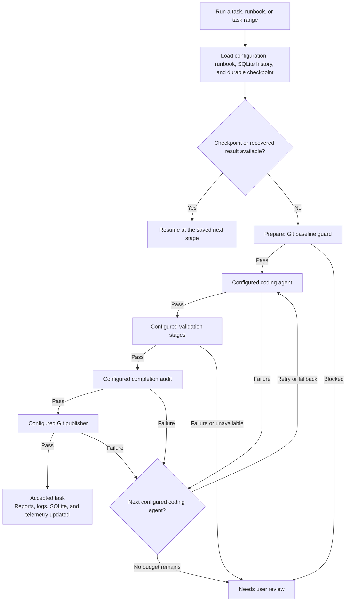

# Supervisor — evidence-gated LangGraph task orchestration

This package orchestrates one small, reviewable runbook task at a time. It
does not impose an application stack, model provider, or QA workflow. Each
project's ignored `supervisor/.env` is the source of truth for its repository
path, enabled agents, execution order, worker commands, validation commands,
timeouts, publishing policy, observability, and platform-specific tooling.
Supervisor provides evidence-gated orchestration around that project contract.

## Quick start

### Install the Supervisor CLI

Download the installer, review it if desired, then run it. It installs into
`~/.local/share/supervisor` and links the commands into `~/.local/bin` without
requiring administrator access:

```zsh
curl -fsSL https://raw.githubusercontent.com/jakowicz/supervisor/main/scripts/install.sh -o /tmp/supervisor-install.sh
bash /tmp/supervisor-install.sh
```

If `~/.local/bin` is not already on your `PATH`, the installer prints the one
`export PATH=...` line to add to your shell profile. Set
`SUPERVISOR_PYTHON=/path/to/python` only when you need to override its automatic
Python 3.10+ selection.

To update the global/installed CLI itself, run:

```zsh
supervisor upgrade
```

To update the Supervisor checkout inside the project you are working in, run
this from that project directory (or one of its subdirectories):

```zsh
supervisor update
```

It finds the nearest `supervisor/` checkout, fast-forwards it, and reinstalls
that project's commands into its virtual environment. It refuses to update when
that checkout has local edits, so it cannot overwrite work. Commit the resulting
submodule-pointer change in the parent project when you are happy with it.

### New project

From an existing Supervisor installation, create a ready-to-configure project:

```zsh
supervisor init
```

The first question asks for the new project directory; enter the location you
want to initialise. You may still pass that directory as an optional argument
when convenient.

`init` automatically selects a compatible Python 3.10+ interpreter from your
`PATH`, then creates a Git repository, adds this repository as `supervisor/`, creates
`runbooks/TEMPLATE.md`, configures ignored root `.state/` evidence storage, and
installs the local virtual environment. It is interactive: it asks for the
initial shared-Langfuse account only when no local service is running, then
prompts for this project's worker commands/models, retry policy, Git policy,
dashboard preference, and Langfuse project credentials. It reuses the one
shared Langfuse service at `http://127.0.0.1:3001` when it is already running.
Use `--non-interactive` only for automated provisioning.

Every setup prompt shows a safe default where one exists. The selected project
profile is only a starting point: inspect and change the generated `.env` to
choose the agents, stage order, validation commands, models, browser/visual QA,
and publishing policy appropriate to that project.

When configuration needs Langfuse project keys, Supervisor first checks the
shared local service. If it is not running, it asks permission to start the
one shared local stack, clearly states that it is installing/starting Langfuse,
and asks for the initial administrator username (email), display name, and
password. That bootstrap creates the default project and securely registers
its key pair for later project setups. If the service is already
running, Supervisor reuses those registered keys when available. Langfuse OSS
does not provide the organization-level project-provisioning API required to
automatically create another project on a running instance, so a project with
unknown credentials still prompts for its existing key pair rather than
modifying the service database.

### Existing project

Add the Supervisor as a submodule, install it, then configure the project:

```zsh
git submodule add git@github.com:jakowicz/supervisor.git supervisor
cd supervisor
python3.11 -m venv .venv
./.venv/bin/python -m pip install -e '.[dev]'
./.venv/bin/supervisor configure
```

### Run your first task

Create a small runbook from `../runbooks/TEMPLATE.md`, for example
`../runbooks/T001.md`. In `supervisor/.env`, configure the workers you intend
to use and explicitly allow edits. Then run the task and inspect its report:

```zsh
./.venv/bin/supervisor-run --runbook ../runbooks/T001.md
./.venv/bin/supervisor-reports browse
```

Evidence, SQLite history, checkpoints, reports, and raw logs always live under
the controlled project's `.state/` directory—not inside `supervisor/`.

## Prerequisites

- Python 3.10 or newer (the current machine's Python 3.9.6 is too old)
- The executables named by your project's `.env` validation and worker commands
- Node/npm and a browser only when the configured browser QA command needs them
- A game profile starts with Flutter validation commands; non-game projects do
  not require Flutter unless they configure it

## Setup

```bash
cd supervisor
python3.11 -m venv .venv
source .venv/bin/activate
pip install -e '.[dev]'
cp .env.example .env
```

### Start a new project

From any existing supervisor installation, create an empty project with the
supervisor checked out as a `supervisor/` Git submodule, a root `runbooks/`
directory, a starter runbook, a root `.state/` ignore rule, an ignored local
configuration file, and an installed virtual environment:

```zsh
supervisor init
```

The command first asks for the new project directory, refuses a non-empty
destination, and never overwrites an existing project. It also reuses the shared local Langfuse service at
`http://127.0.0.1:3001`; only when that endpoint is absent does it run the
local observability bootstrap. It uses `git@github.com:jakowicz/supervisor.git` by default; use
`--supervisor-url <URL>` to select a fork or another remote. Use `--no-install`
when creating the virtual environment and dependencies is not currently
possible, or `--no-observability` when configuring a remote/shared service
yourself, then complete the install later from `<project>/supervisor`:

```zsh
python3.11 -m venv .venv
./.venv/bin/python -m pip install -e '.[dev]'
./.venv/bin/supervisor configure
```

Runtime evidence is deliberately stored at `<project>/.state/`; no operational
`.state/` directory is created inside the reusable `supervisor/` submodule.

Set `SUPERVISOR_REPO_ROOT` to the controlled project root if invoking from
another directory. Add worker command adapters only after verifying their
credentials, permissions, and worktree handling.

For a reusable project setup, run the interactive configuration CLI after the
editable install:

```bash
supervisor configure
```

It writes an ignored, mode-600 `.env` and prompts for project paths, enabled
agents and their commands/models, total retry attempts, dashboard preference,
Git policy, timeouts, and optional Langfuse credentials. The dashboard chooses
a free localhost port when its preferred port is occupied. When installed as
`supervisor`, the default database path is
`<project-root>/.state/supervisor.sqlite3`, so project evidence remains outside
the reusable submodule.

### Project configuration is the contract

The `.env` file—not this README—defines how a particular project runs. Typical
settings include:

```dotenv
# Select the implementation agents and pipeline for this project.
SUPERVISOR_CODING_AGENTS=codex
SUPERVISOR_AGENT_ORDER=codex,test,completion_audit,git_publish

# Define every deterministic validation command in execution order.
SUPERVISOR_TEST_COMMANDS=["npm test","npm run build"]

# Configure the commands and publication policy that this project permits.
CODEX_COMMAND=./.venv/bin/python scripts/codex_worker.py {task_file}
SUPERVISOR_ALLOW_AUTONOMOUS_WRITES=true
SUPERVISOR_AUTO_COMMIT=false
SUPERVISOR_AUTO_PUSH=false
```

The game profile supplies Flutter analysis, tests, and web release build as an
editable `SUPERVISOR_TEST_COMMANDS` default. A document-only project may use
Codex alone. A native application, language implementation, operating system,
or service supplies its own commands. Re-run `supervisor configure` whenever
the project contract changes.

### Optional bundled adapters

The included Qwen, OpenHands, and Codex adapters translate configured CLI output
into the required `WorkerResult` JSON object. They are optional examples; a
project enables only the adapters named in its `.env`. No coding adapter runs
until `SUPERVISOR_ALLOW_AUTONOMOUS_WRITES=true` is set.

Add these lines to `.env` when ready:

```dotenv
QWEN_CODER_COMMAND=./.venv/bin/python scripts/qwen_worker.py {task_file}
OPENHANDS_COMMAND=./.venv/bin/python scripts/openhands_worker.py {task_file}
CODEX_COMMAND=./.venv/bin/python scripts/codex_worker.py {task_file}
SUPERVISOR_ALLOW_AUTONOMOUS_WRITES=true
```

`qwen_worker.py` runs Qwen in its sandboxed non-interactive mode, with the
project's Codebase Memory MCP available for repository-aware discovery. It
uses Qwen's JSON-schema output mode so a readable agent summary cannot bypass
the supervisor's required `WorkerResult` evidence contract.
`openhands_worker.py` runs OpenHands headlessly with its LLM security-approval
mode. When `LLM_MODEL` uses `ollama/...`, it converts the shared OpenAI-compatible
`LLM_BASE_URL` ending in `/v1` to Ollama's native root URL before OpenHands runs.
The Codex adapter uses `codex exec` with `workspace-write`, a strict
schema-enforced final response, and `--skip-git-repo-check` because this checkout
currently has no Git metadata. All three are constrained to
`SUPERVISOR_REPO_ROOT`; the Codex adapter does not use danger-full-access or
bypass the Codex sandbox.

To use the locally loaded Ollama model for both Qwen and OpenHands, set:

```dotenv
QWEN_MODEL=qwen3-coder-next:latest
LLM_MODEL=ollama/qwen3-coder-next:latest
LLM_BASE_URL=http://127.0.0.1:11434/v1
LLM_API_KEY=ollama
```

The same shared `/v1` URL is correct: Qwen uses the OpenAI-compatible endpoint,
while the OpenHands adapter automatically removes that suffix for LiteLLM's native
Ollama provider. The supervisor stores an isolated OpenHands profile at
`.state/openhands`, copying its existing MCP configuration on first use, and
disables thinking there for Ollama-backed fallback work. This avoids unsupported
thinking requests from local models such as qwen3-coder-next without changing
your global OpenHands profile. Do not create a second OpenHands-specific URL
variable.

The supervisor keeps Qwen's normal model/context settings. If you ever need a
lower-context diagnostic tag, the included optional tag reuses the installed
weights rather than downloading another model:

```zsh
ollama create qwen3-coder-next-32k -f models/qwen3-coder-next-32k.Modelfile
```

The worker fails over after ten minutes with no model or tool output. Adjust
`SUPERVISOR_QWEN_IDLE_TIMEOUT_SECONDS` only when a live Qwen log shows genuine
ongoing output.

## Run a safe graph check

```bash
supervisor-run --task-id T01 --title "Inventory reconciliation" --dry-run
pytest
```

The dry run exercises the configured graph without invoking external coding
providers, validation commands, browsers, or publication. It reports the
configured route and evidence contract without changing the project.

## Enable real workers incrementally

1. Configure one or more coding-adapter commands and list them in
   `SUPERVISOR_CODING_AGENTS`. Every adapter receives `{task_file}` and must
   emit one `WorkerResult` JSON object.
2. Define the project validation contract in `SUPERVISOR_TEST_COMMANDS`.
3. Add browser or visual-review commands only if those checks are meaningful
   for the selected platforms and product surface.
4. Set the intended execution order, retry budgets, write policy, and Git
   policy in `.env`.
5. Run a small runbook first. Environment failures and unproven acceptance
   criteria stop for review; they do not become implicit success.

## Execution flow



Retry budgets, coding fallback order, QA stages, and publication are all
project policy defined in `.env`. Environment failures do not consume coding
budget, and a task range runs sequentially, stopping before later tasks when an
earlier task is not accepted.

Evidence and run history are stored in `<project-root>/.state/supervisor.sqlite3`.
Configured QA commands record their evidence in the project-defined location.

The same SQLite database also holds durable task checkpoints. During a coding
run the supervisor records the active process, resumable agent-session metadata
where the adapter supports it, last tool activity, changed-file fingerprint,
and the next pipeline stage. If a run is interrupted, invoke the same task
again: it resumes available session state and continues at the unfinished stage
rather than reimplementing completed work.
Only one live supervisor may claim a task at a time. Once a task is accepted at
a recorded Git commit, a repeat invocation is a safe no-op; create a new task
ID for additional scope.

If a completed run ends in `needs_user_review` because a coding or verification
failure needs another autonomous repair pass, preserve its worktree/history and
restart the primary implementation stage explicitly:

```zsh
supervisor-run --task-id D008 --retry
```

The retried agent receives the concrete failing test/browser evidence; it does
not silently discard the candidate or reuse a completed agent session.

If a resumable coding stage already emitted a valid final `WorkerResult` in its
raw live log, the next invocation can recover that result and continue at the
next configured validation stage. It does not ask a coding agent to rediscover
or rewrite the task. Final acceptance still depends on the configured evidence
and audit gates.

When Langfuse observability is enabled, each completed stage is exported with
its full evidence. Adapters that support live checkpoints can also emit bounded
progress summaries while they are running.

## Inspecting reports

`supervisor-reports` opens the SQLite database read-only:

```bash
supervisor-reports list
supervisor-reports list --task D006
supervisor-reports task-state D006
supervisor-reports show <run-id>
supervisor-reports events <run-id>
supervisor-reports export <run-id> --output /private/tmp/d006-run.json
```

The supervisor prints a short completion handoff by default; full worker
transcripts remain in the stage logs and SQLite rather than being repeated in
the terminal. Add `--output-format json` only when a script needs the complete
machine-readable run payload.

## Optional browser QA and metrics dashboard

When the project configures the bundled Playwright browser worker, install
Playwright and its Chromium browser once:

```bash
cd browser
npm install
npx playwright install chromium
```

The bundled worker is a Flutter-web/Playwright example. Other projects should
set `BROWSER_QA_COMMAND` to their own server, device, integration, or visual
validation command—or omit the browser stage entirely. Evidence locations are
part of the project's configured QA contract.

For the bundled worker, browser-impacting tasks declare their targeted
Playwright coverage and the worker runs its configured smoke/full-suite policy.
Projects that use another browser or device command define their own test paths,
evidence, and cadence in that command.

## Runbooks

### Named project workspaces

For a runbook factory that stores briefs and generated work under `projects/`,
run the complete project workflow with:

```zsh
supervisor-run --project my-project
```

It reads `projects/my-project/INITIAL.md`, runs the factory, follows only that
workspace's child collections, and keeps durable factory state in
`projects/my-project/.supervisor/factory.sqlite3`. Repeating the same command
skips accepted tasks and resumes the first unfinished task. List all named
workspaces, their phase, progress, next task, and resume command with:

```zsh
supervisor projects
```

The source batch is split into one immutable task contract per file under
`../../runbooks/`. The supervisor loads it automatically by ID, so there is no
need to retype the objective or acceptance criteria:

```bash
supervisor-run --task-id D005
```

Or pass an explicit task file when working outside the standard set:

```bash
supervisor-run --runbook ../../runbooks/D005.md
```

Run an installed range in sequence with one shared worktree and one model at a
time:

```bash
supervisor-run --task-range D007-D010
```

Run an entire collection once, including any new runbooks created by accepted
tasks during the run:

```bash
supervisor-run --run-all --runbooks-dir ../../runbooks --initial ../../projects/my-project/INITIAL.md
```

Use `--initial PATH` when the brief belongs to a named project rather than the
reusable runbook collection. Supervisor reads that file first and appends its
context to every task. Without the flag, it looks for `INITIAL.md` in the
collection; a generated collection can instead inherit its parent project's
`PROJECT_BRIEF.md`. It re-enumerates the collection after each accepted wave,
so bounded planning or authoring tasks can safely create the next wave without
the operator restarting Supervisor.

For intentionally chained collections, add a JSON registration beneath the
parent collection:

```text
<runbooks-dir>/.supervisor-children/<name>.json
```

```json
{"runbooks_dir": "../path-to-child-runbooks"}
```

After the parent completes, `--run-all` follows each registered child collection
recursively. This is explicit by design: Supervisor never scans and executes
arbitrary directories. Collection state is stored beside each collection's
parent in `.supervisor/supervisor.sqlite3`, so generated task IDs such as
`R0001` remain isolated across projects. Set `SUPERVISOR_DATABASE_PATH` only
when deliberately sharing state.

## Updating project configuration safely

`supervisor update` fast-forwards the project-owned `supervisor/` checkout,
reinstalls its CLI, then runs the newly downloaded version's environment
migrations. The authoritative, append-only history is committed to the
Supervisor repository in `supervisor/env_migrations.json`. `supervisor update`
compares that manifest with `SUPERVISOR_ENV_SCHEMA_VERSION` in the project's
private `.env`, adds missing safe defaults or declared renamed keys, and never
overwrites an existing project value.

Use `supervisor env-migrate --config .env` to inspect/apply the same migration
step manually. Each future configuration change must add a migration entry to
`supervisor/env_migrations.json`; do not rely on copying `.env.example` over a
project file. The test suite enforces that `.env.example` declares the current
schema version and documents every key introduced by the migration manifest.

The batch starts D008 only after D007 is accepted. This prevents an unfinished
or unreviewed task from becoming the implicit baseline for later work. For a
known-independent batch, `--continue-on-nonpass` explicitly permits the next
task after a failure or review stop.

Each runbook declares its sequence, browser-impact policy, and targeted
Playwright spec. Do not override those fields at the command line: edit and
review the runbook first so the stored task report remains auditable.

## Agents and stages

The configured environment defines the project pipeline. Supervisor's job is to
run the named stages, capture evidence, enforce the task contract, and stop for
review when a configured stage cannot prove success. A coding agent never
accepts its own work.

| Configuration | Project-owned decision |
| --- | --- |
| `SUPERVISOR_CODING_AGENTS` | Which implementation adapters are eligible and their order. |
| `SUPERVISOR_AGENT_ORDER` | Which configured stages run for this project. |
| `*_COMMAND` | The exact adapter, browser, visual-review, or project command to invoke. |
| `SUPERVISOR_TEST_COMMANDS` | Ordered deterministic validation commands. |
| Retry, timeout, and write variables | How much autonomous work is permitted. |
| Git and observability variables | Whether accepted work may publish and where evidence is exported. |

Bundled adapters and common stages such as `codex`, `test`, `browser`,
`visual_review`, `completion_audit`, and `git_publish` are available where
configured; they are not a universal required pipeline. Use the `.env` for the
actual project contract and `supervisor configure` to edit it interactively.

### Optional local asset lane

Runbooks can explicitly opt into a local original-art lane without changing
the normal code pipeline. A task with `asset_impact: required` runs an
art-director brief, local ComfyUI generator, deterministic asset finisher and
provenance/technical asset QA before the first coding agent. It then continues
through the usual Codex verification, deterministic tests, Playwright, visual
evidence, completion audit and Git publisher.

```yaml
asset_impact: required
asset_brief: docs/art/briefs/my-asset.md
asset_ids: village_gate_001,village_gate_001_construction
visual_style_version: project-v1
```

Configure the lane with the three worker commands and a local ComfyUI URL in
`.env`; `.env.example` supplies defaults for the included Z-Image Turbo worker.
It is deliberately opt-in: a persistence or combat task never starts image
generation. The selected asset, workflow JSON, prompt, seed and hashes are
stored under `assets/generated/<asset-id>/`; candidates are local ignored
files, while `selected.png` is the commit-ready production source.

When `SUPERVISOR_AUTO_COMMIT=false`, the Git publisher records that no commit
was created but still accepts a task once all implementation and QA gates pass.
This lets local and mock task ranges continue without granting the supervisor
Git-write authority. Enable auto-commit only when the clean-worktree preflight
can safely attribute the resulting commit to one task.

When a run starts, the terminal immediately prints its run ID, current stage,
route decision, and its live log location. Inspect an active or completed run:

```bash
tail -f ../.state/live/task-<task-id-lower>-run-<run-number>-stage-00-agent-supervisor-<run-id>.log
supervisor-reports events <run-id>
```

The detailed event report is persisted when the run finishes. The live log
records stage transitions while a worker is running; the individual CLIs keep
their complete captured stdout/stderr in the final event evidence. Each
completed stage also writes its own human-readable raw-output log:

```text
../.state/live/task-d006-run-11-stage-01-agent-prepare-<run-id>.log
../.state/live/task-d006-run-11-stage-02-agent-<configured-stage>-<run-id>.log
../.state/live/task-d006-run-11-stage-03-agent-test-<run-id>.log
../.state/live/task-d006-run-11-stage-00-agent-supervisor-<run-id>.log
```

Browse the SQLite history interactively, selecting a task, run, then stage:

```bash
supervisor-reports browse
```

Or print all preserved raw output for one completed run:

```bash
supervisor-reports events <run-id> --raw
```

After the completion audit the Git publisher can commit, then push, only when
`SUPERVISOR_AUTO_COMMIT=true` and `SUPERVISOR_AUTO_PUSH=true`. Before agents
start, it requires a clean Git worktree; therefore the final non-empty diff is
task-only. It then checks the diff and publishes only after every QA gate.
Use a dedicated worktree for each task when multiple tasks may run at once.

Start the read-only Run Ledger dashboard from the supervisor directory:

```bash
supervisor-dashboard --serve
```

Open `http://127.0.0.1:8765` to view accepted/review outcomes, worker load,
failure categories, average stages per run, and recent agent-routing traces.
Use the **Evidence archive** navigation link (or open
`http://127.0.0.1:8765/logs`) to choose a task, run, and stage, then review
the complete locally stored raw output.

## Local Langfuse observability

Run Ledger remains the authoritative local archive for complete raw
stdout/stderr and evidence files. Langfuse adds a searchable OpenTelemetry
trace tree alongside it: task = Langfuse session, one supervisor execution =
trace, and every worker/QA/audit stage = nested observation.

For normal project setup, do **not** run this script yourself: `supervisor init`
checks for the one shared local instance and starts it only when absent. Each
project then uses `supervisor configure` to supply the appropriate existing
Langfuse project keys.

`observability/setup-local.sh` is the underlying bootstrap and recovery tool
for the shared local stack (Postgres, ClickHouse, Redis, and MinIO remain in
Docker volumes on this machine). Run it directly only when intentionally
creating or repairing that central Langfuse installation:

```bash
cd observability
./setup-local.sh
```

For a brand-new local instance, choose the initial Langfuse administrator
instead of accepting the defaults:

```bash
./setup-local.sh --email you@example.com --name "Your Name" --password "choose-a-strong-password"
```

The equivalent environment variables are `LANGFUSE_SETUP_EMAIL`,
`LANGFUSE_SETUP_NAME`, and `LANGFUSE_SETUP_PASSWORD`. These options apply only
to the first bootstrap; the script deliberately refuses to overwrite an
existing account or a running shared Langfuse service.

The bootstrap creates a **Runbook Supervisor** project and local API keys,
then enables telemetry in `.env`. Sign in at `http://127.0.0.1:3001` as
`local@supervisor.invalid`; the generated password is stored only in
`observability/.env` as `LANGFUSE_INIT_USER_PASSWORD`. This explicit bootstrap
keeps all credentials and telemetry on the local machine.

Backfill the existing SQLite history after enabling it:

```bash
supervisor-observability-import --all
```

The importer never changes SQLite or the existing files. It sends structured
stage results plus complete raw evidence to the local Langfuse project when
`SUPERVISOR_OBSERVABILITY_RAW_LOG_MAX_CHARS=-1` (the local default). It also
turns agent JSONL into nested generation, tool, and final-result observations
with available token usage. Full logs and artifacts remain in `<project-root>/.state/` too.
Use a positive character limit if you later want compact remote telemetry.

## Production execution policy

- The `.env` pipeline defines coding attempts, fallback order, validation,
  browser/device checks, review, and publishing for the project.
- `SUPERVISOR_TEST_COMMANDS` is the deterministic validation contract; a game
  profile starts with Flutter commands, while every other project can provide
  its own tools and commands.
- A missing or broken configured validation environment stops for review rather
  than consuming coding-agent budget.
- The completion audit blocks acceptance unless the configured stages provide
  evidence for every acceptance criterion, documentation decisions, exact
  checks, and known limitations.
- SQLite keeps the full event log, including stage, worker, configured model,
  attempt, route, summary, structured result, logs, and screenshot paths.
  Each completed run also writes a skim-friendly agent/progression summary to
  `<project-root>/.state/reports/<run-id>.md`.

Run D006 with explicit acceptance criteria:

```bash
./.venv/bin/supervisor-run \
  --task-id D006 \
  --title "Trusted local time and background-safe timers" \
  --objective "Implement only D006 from GWEN_DETAILED_RUNBOOK_001_010.md." \
  --acceptance "Domain callers use injected wall-clock and monotonic-time interfaces." \
  --acceptance "Typed time anomalies cover material backward and extreme forward jumps." \
  --acceptance "No resource production or construction UI is added."
```
